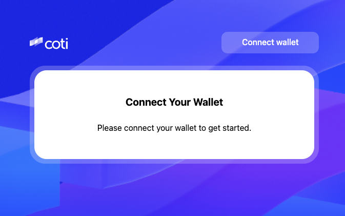

# Setting up COTI Snap with your MetaMask wallet

Last updated: October 2025\
Estimated time: 5 minutes\
Requirements: MetaMask (desktop), COTI Mainnet connection

\
Stage 1 — Install the COTI Snap

#### What you’ll need

* MetaMask wallet (desktop browser extension)
* Access to the official COTI Snap install link

Mobile browsers are not supported yet.\\

#### Step 1 — Connect your wallet

1. Navigate to metamask.coti.io.
2. Click Connect Wallet.
3. MetaMask will open a prompt asking:\\

<figure><figcaption></figcaption></figure>

This step allows MetaMask to enable private token support through the Snap.

#### Step 2 — Install the COTI Snap

1. Click Install COTI MetaMask Snap.
2. If you don’t already have the Snap installed, MetaMask will prompt you automatically.
3.  Approve the installation.\
    \
    \\

    <figure><figcaption></figcaption></figure>

#### Step 3 — Approve connection

1. MetaMask will ask for permission to connect the Snap to your wallet.
2. Click Approve when prompted.

\\

<figure><figcaption></figcaption></figure>

\\

#### Step 4 — Choose your account and connect

Select the account you wish to use with the Snap (recommended: your COTI Mainnet account) and click Connect.

You’ve successfully added the COTI Snap to MetaMask!

### Stage 2 — View your COTI Private Token balances

#### Step 5 — Confirm Snap installation

1. In MetaMask, click your Profile icon → Settings → Snaps.
2. You should now see COTI Snap listed and active.\
   \\

<figure><figcaption></figcaption></figure>

\
\\

<figure><figcaption></figcaption></figure>

#### Step 6 — Onboard your account

1. In MetaMask, click Onboard Account.
2. MetaMask will open a popup to register your account with the Snap.
3.  Click Confirm when prompted.\
    \
    \
    \\

    <figure><figcaption></figcaption></figure>

#### Step 7 — Sign and authorize

MetaMask will display a Signature Request popup.\
Click Confirm to authorize the onboarding.\
The message may appear encrypted — this is expected.\
This simply verifies your ownership and uses a small amount of COTI for gas.\
\
\\

<figure><figcaption></figcaption></figure>

#### Step 8 — Approve the connection

1. MetaMask will display the request from snap.coti.io on the COTI Mainnet.
2. Click Confirm to proceed.

\\

<figure><figcaption></figcaption></figure>

#### Step 9 — Grant AES key access

1. The COTI app will now request access to your AES Key — used for decrypting your private balances.
2. Click Request, and when MetaMask pops up, choose Approve.

Without this step, you can hold private tokens, but you won’t be able to view balances.\\

<figure><figcaption></figcaption></figure>

#### Step 10 — Launch the dApp

Click Launch dApp to open the COTI Snap application and view your private token balances.\
\\

<figure><figcaption></figcaption></figure>

You’ve completed Stage 2 — your COTI Snap is live and connected!

\\

### Stage 3 — Send and Receive Private Tokens

Private ERC-20 tokens on COTI are not standard ERC-20s — they include encrypted data and special logic.\
Some wallet or explorer behaviors may differ from standard tokens.

#### Step 13 — Import your private token

1. In MetaMask Snap, click Import Tokens.
2. Paste the private token’s contract address
3. Click Next → Import and confirm in MetaMask.\
   \\

<figure><figcaption></figcaption></figure>

#### Step 14 — View token details

Once imported, the token will appear in your Assets list.\
Click it to open details and balance (shown through the Snap’s decryption layer).\
\\

<figure><figcaption></figcaption></figure>

#### Step 15 — Send your private token

1. Click Send Token in the COTI dApp or Snap interface.
2. Enter the recipient’s address and confirm.
3. Approve the request in MetaMask.

<figure><figcaption></figcaption></figure>

The transaction is now live on-chain — encrypted and private.

\\
