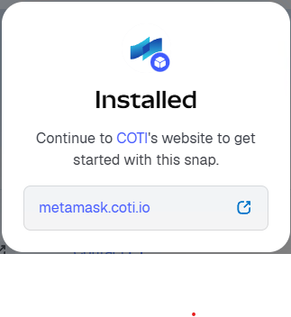

# COTI MetaMask Snap

The COTI MetaMask Snap allows users to onboard their COTI accounts, add/decrypt on-chain tokens and NFTs , and interact with COTI dApps.

<figure><figcaption>
Coti Snap running inside MetaMask
</figcaption></figure>

### Getting Started

#### 1. Install the Snap

As a user, you can start by installing the snap here:

[**COTI Snap**](https://snaps.metamask.io/snap/npm/coti-io/coti-snap/)

Simply click the "**Add to MetaMask**" button on the upper right hand side of the screen and follow the prompts in your MetaMask wallet.

Once you click the "**Connect**" button, the prompt will go over the necessary permissions:

<figure><figcaption>
COTI snap installation screen
</figcaption></figure>

The snap will request permissions stated in the details of the snap webpage.

Once the snap is installed, the MetaMask site will offer to continue to COTI's companion dApp website to get started with the snap.

<figure><figcaption></figcaption></figure>

#### **2. Onboard Account (Retrieve AES Key)**

Once you are in the companion dApp site ([metamask.coti.io](https://metamask.coti.io)):

1. Click on the "**Connect Wallet**" button, follow the prompts on MetaMask.
2. You might be prompted to install the snap via the companion dApp. it is an attempt of the snap to connect to the metamask.coti.io dApp
3. Click on the "**Onboard**" button. The prompt will indicate the contract you are interacting with. Click the "**Onboard**" button. Follow the prompts on MetaMask.\
   \
   **NOTE**: Because the data from the onboarding operation is encrypted and MetaMask does not know how to decrypt this data, the "_**Signature request**_" screen in MetaMask will show illegible characters. This is normal.\
   \
   .png>)\

4. Once your account is onboarded, you will have to request Metamask to allow access to the security key:
   1. Click the "**Reveal**" button to view your AES key.&#x20;
   2. Click the "**Delete**" button to delete your AES key.


**NOTE**: Your AES key should be treated with the same sensitivity as your MetaMask private key. Users who can obtain this key will be able to decrypt sensitive data on the COTI network.


5. Click on Launch dApp and that will navigate to the token management so you could import any token that are private and interact with them (send/receive)
